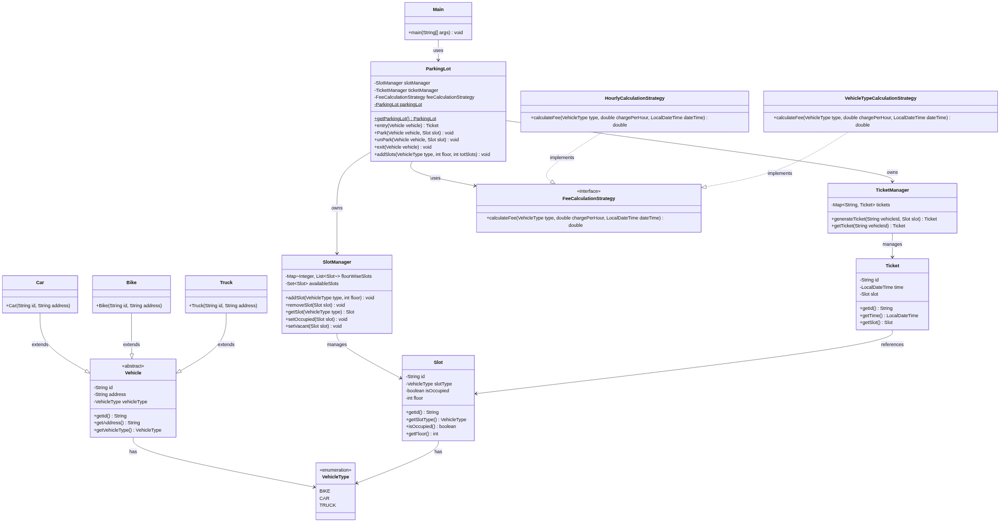
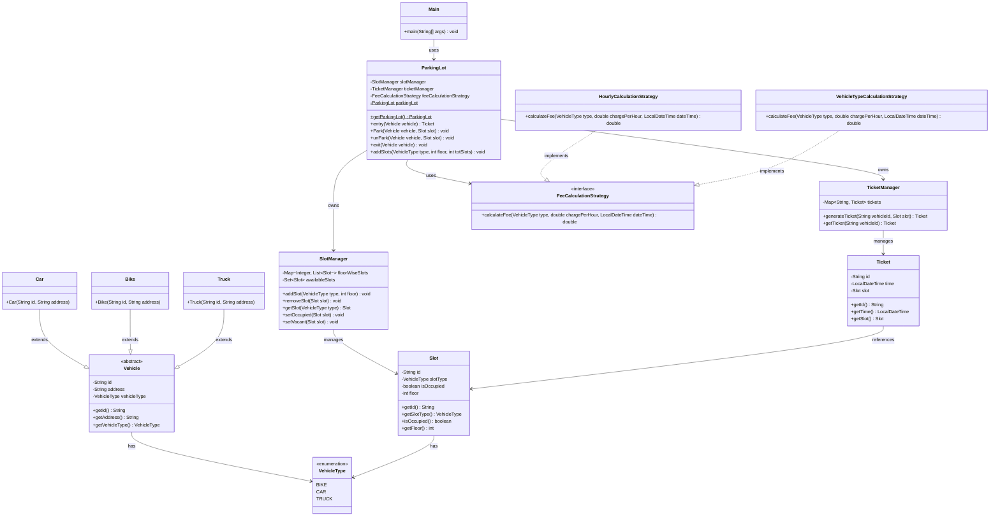

# Parking Lot LLD

Multi-floor parking lot supporting multiple vehicle types (bike, car, truck).
Vehicles are issued a ticket on entry, parked/un-parked from slots, and
charged a fee based on a pluggable strategy on exit.

## Package Structure

```
ParkingLot/
├── Main.java                              # Entry point - demo flow (entry, park, unpark, exit)
├── ParkingLot.java                         # Facade/singleton - orchestrates slot, ticket & fee logic
├── manager/
│   ├── SlotManager.java                    # Owns floor-wise slots, tracks availability
│   └── TicketManager.java                  # Issues and looks up tickets per vehicle
├── model/
│   ├── Vehicle.java (abstract), Car/Bike/Truck.java
│   ├── VehicleType.java                    # Enum: BIKE, CAR, TRUCK
│   ├── Slot.java                            # Parking slot state
│   └── Ticket.java                          # Entry ticket (time + slot)
└── strategy/
    ├── FeeCalculationStrategy.java          # Strategy interface
    ├── HourlyCalculationStrategy.java       # Flat hourly rate
    └── VehicleTypeCalculationStrategy.java  # Rate multiplier per vehicle type
```

## Class Diagram



<details>
<summary>Mermaid source</summary>



</details>

## Key Design Points

- **`ParkingLot`** is a singleton facade that coordinates `SlotManager`,
  `TicketManager`, and the fee calculation strategy.
- **`SlotManager`** (manager) owns floor-wise slot allocation and availability.
- **`TicketManager`** (manager) issues and retrieves tickets per vehicle.
- **`FeeCalculationStrategy`** (strategy pattern) decouples fee calculation
  from `ParkingLot`, allowing `HourlyCalculationStrategy` or
  `VehicleTypeCalculationStrategy` to be swapped in.
- **`Vehicle`** is an abstract base for `Car`, `Bike`, and `Truck`.
