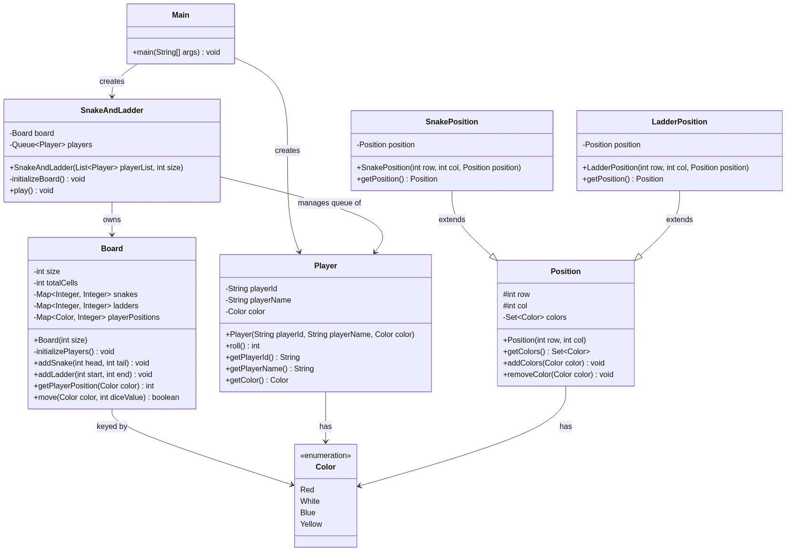
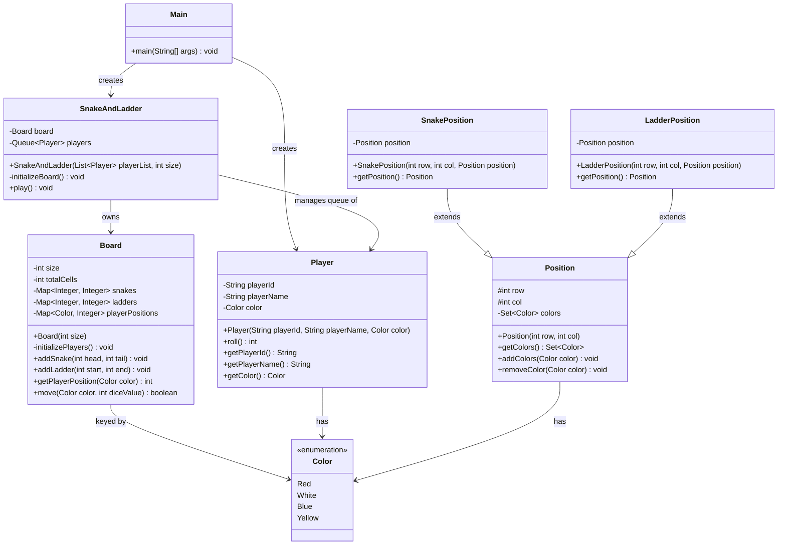

# Snake and Ladder LLD

Multi-player Snake and Ladder game played on an `n x n` grid. Players take turns
rolling a die and advancing their token; landing on a snake sends the player
down, landing on a ladder sends the player up. First player to reach the last
cell (exact roll required) wins.

## Package Structure

```
SnakeAndLadder/
├── Main.java                # Entry point - sets up players and starts the game
├── SnakeAndLadder.java       # Game controller - turn loop, win detection
├── manager/
│   └── Board.java            # Owns board state: snakes, ladders, player positions
└── model/
    ├── Color.java             # Player color/token enum
    ├── Player.java             # Player identity + dice roll behavior
    ├── Position.java           # Base cell (row, col) on the board
    ├── SnakePosition.java      # Position representing a snake head -> tail
    └── LadderPosition.java     # Position representing a ladder start -> end
```

## Class Diagram



<details>
<summary>Mermaid source</summary>



</details>

## Key Design Points

- **`Board`** (manager) encapsulates all board state and mutation logic
  (snakes, ladders, player positions) so `SnakeAndLadder` only orchestrates
  turns and win detection.
- **`Player`** owns its own dice-roll behavior via `roll()`.
- **`SnakePosition`** / **`LadderPosition`** extend `Position` to model
  special cells on the board distinctly from plain cells.
